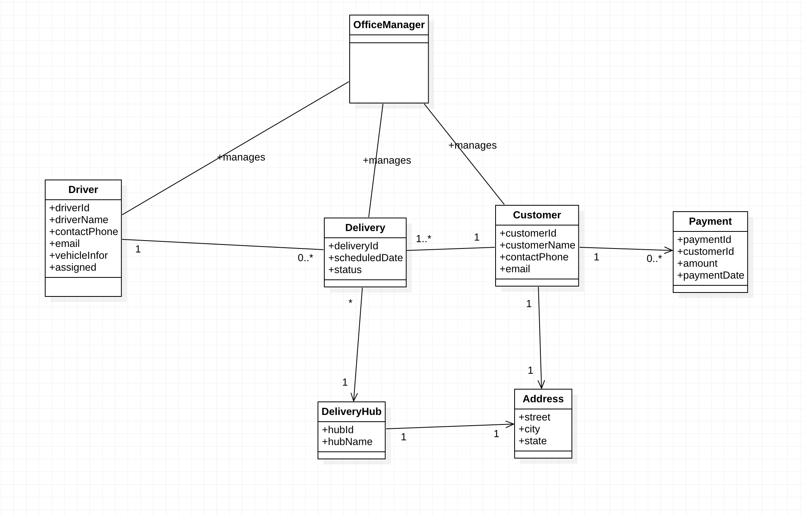
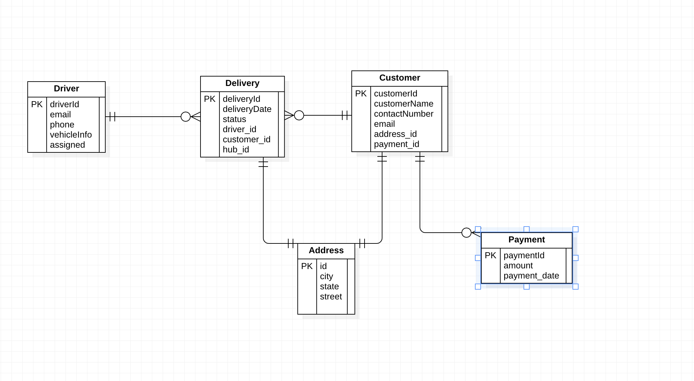

## Fenix Delivery System ##

**Problem Statement/Description:**

Fenix Delivery System,  (FDS) is a company that is in the business of managing a growing network of delivery operations across cities 
in the Central Africa region.
The business grown and now it requires to design and develope a web-based software solution that the company will use to manage deliveries.

The system will be used by an Office Manager to register Delivery Drivers who apply to join their network of delivery operations. 
Each Delivery Driver is given a unique ID number, and their name, Contact Phone Number, Email, Vehicle Information,
and Availability these are recorded into the system.

The Office Manager also uses the system to enroll new Customers who require delivery services, including the Customer’s name, Contact Phone Number, Email,
Delivery Address, and Payment Information. A Customer can call in to request a delivery service or submit an online form on the FDS website. 
Upon receiving a request for a delivery, the Office Manager can then book the delivery, and delivery details are recorded accordingly.

Delivery Drivers should be able to sign in to the system and view a listing of all their assigned Deliveries, 
including details of the Customers they have been scheduled to serve. Each delivery is normally scheduled for a specific date and time, and the 
Delivery Driver is expected to fulfill the delivery at the Customer’s specified address. The system should provide information about each Delivery Hub, 
including its name, location address, and telephone number.

Customers should be able to sign in to the system and view their deliveries, including the information of the 
Delivery Driver assigned to their request. 

A Delivery Driver cannot be assigned more than 3 deliveries in any given week. 

**Requirement Analysis**
- The system should be used by an Office Manager to register Delivery Drivers 
- The system should save data for delivery driver
- The system should be used by an Office Manager to enroll new customers
- The system should be able to fulfil  the delivery at the customer's specified address.
- The system should be able to provide information about each Delivery Hub
- The system should enable customers to sign in and view their deliveries
- The Driver cannot be assigned more than deliveries

**UML Class Diagram**

**ER Diagram**

**Architecture**
